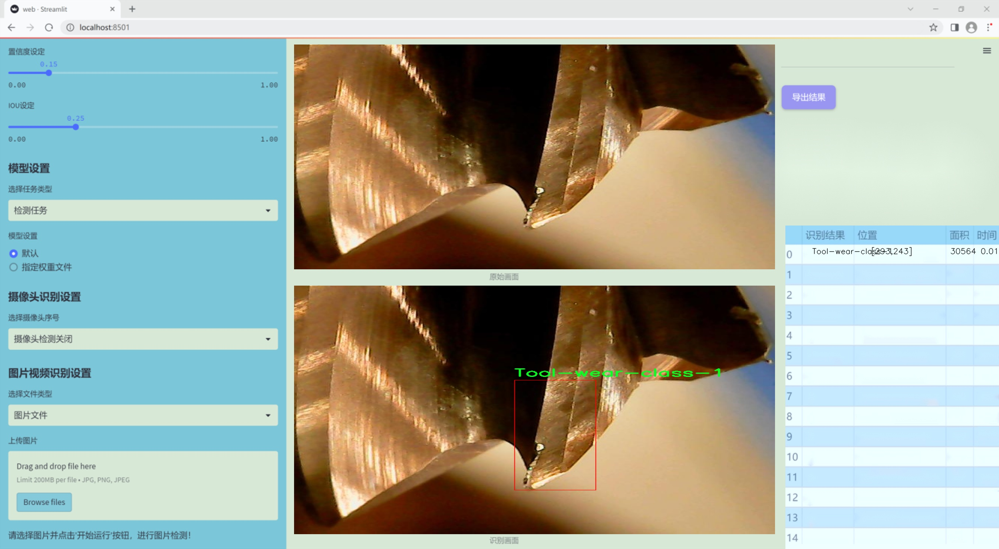
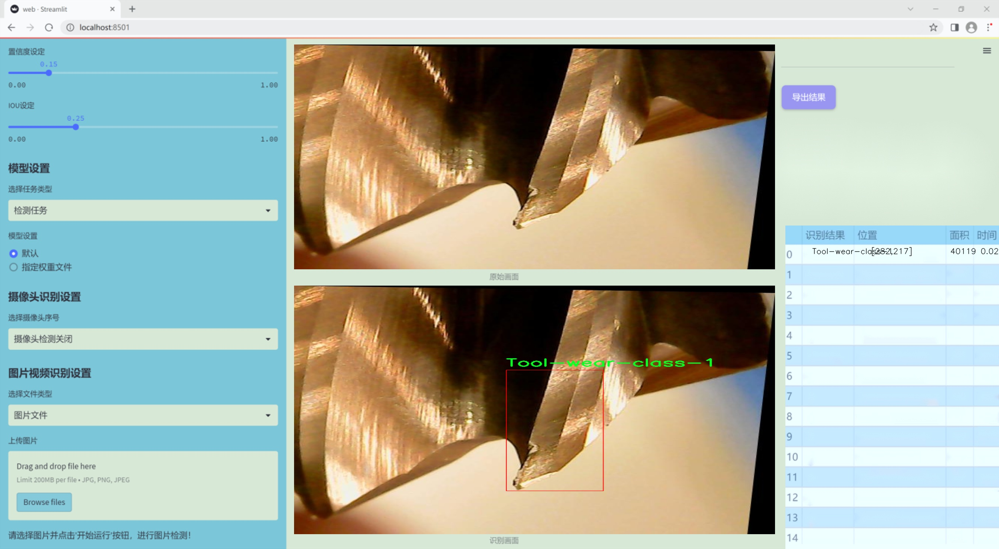
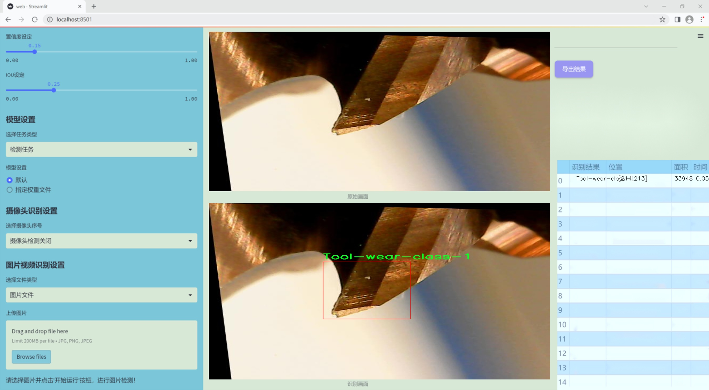
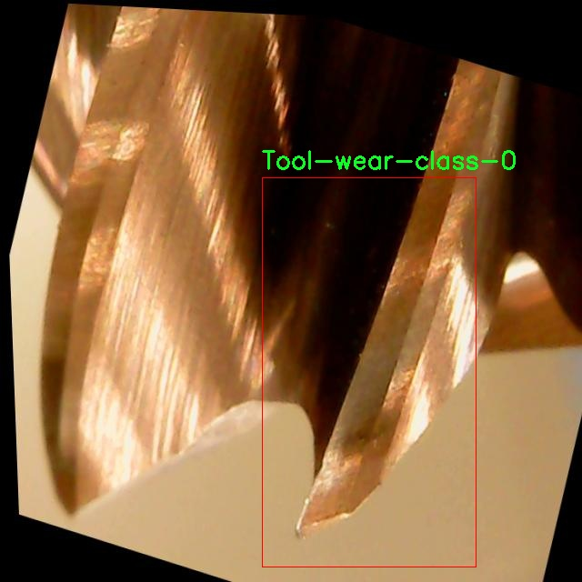
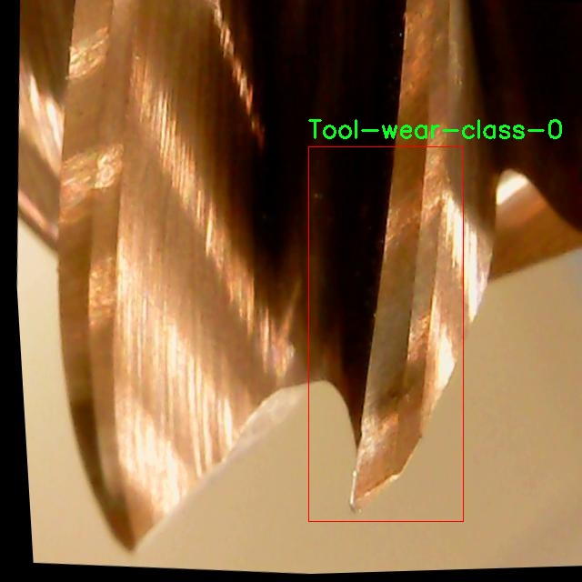
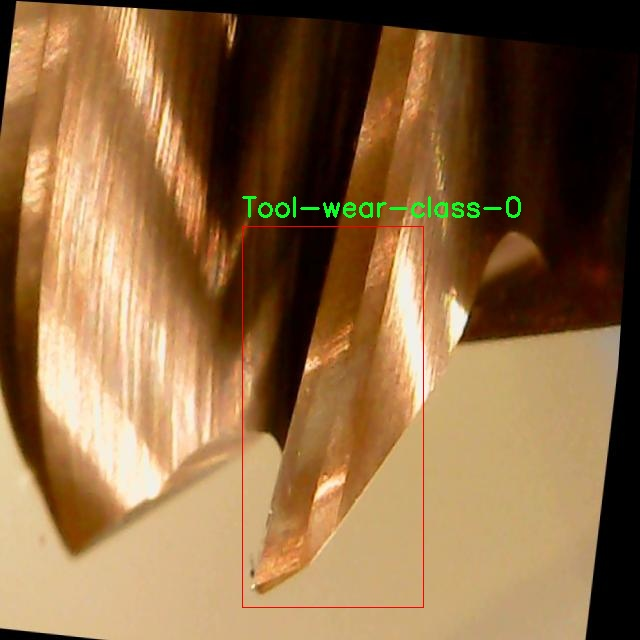
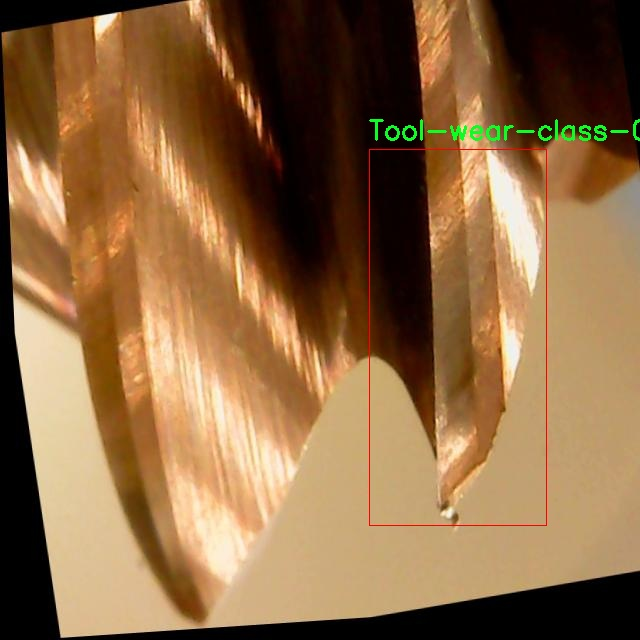
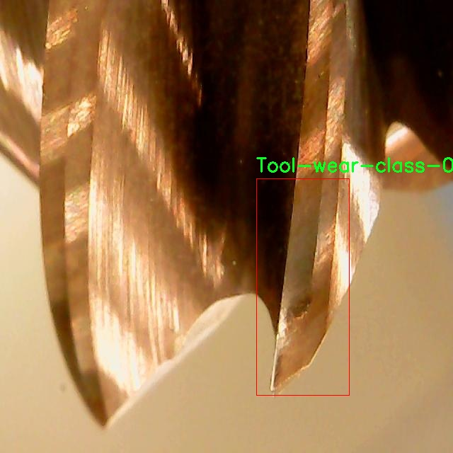

### 1.背景意义

### 研究背景与意义

刀具磨损检测是制造业中一个至关重要的环节，直接影响到生产效率和产品质量。随着工业自动化和智能制造的快速发展，传统的人工检测方法逐渐暴露出效率低、准确性差等问题。因此，基于计算机视觉的自动化检测系统应运而生，成为提升生产效率和降低成本的重要手段。近年来，深度学习技术的迅猛发展为图像识别和分类提供了强大的工具，其中YOLO（You Only Look Once）系列模型因其高效的实时检测能力而备受关注。

本研究旨在基于改进的YOLOv11模型，构建一个高效的刀具磨损检测系统。通过对刀具磨损状态的实时监测，可以及时发现刀具的磨损情况，从而采取相应的维护措施，避免因刀具失效导致的生产停滞和资源浪费。数据集的构建是实现这一目标的基础。本研究使用的刀具磨损数据集包含四个类别，分别为刀具磨损的不同程度，涵盖了从无磨损到严重磨损的多种状态。该数据集不仅包含506张经过精心标注的图像，还通过多种数据增强技术提升了模型的泛化能力，确保其在实际应用中的可靠性。

在数据集的构建过程中，采用了YOLOv8格式进行标注，并对图像进行了自动方向调整和尺寸统一，确保数据的一致性和可用性。通过引入多种图像增强技术，如随机翻转、旋转和模糊处理，进一步丰富了训练样本的多样性，提高了模型在不同环境下的适应能力。这些措施不仅增强了模型的鲁棒性，也为后续的刀具磨损检测提供了坚实的数据基础。

综上所述，基于改进YOLOv11的刀具磨损检测系统的研究，不仅能够推动制造业的智能化进程，还为相关领域的研究提供了新的思路和方法，具有重要的理论价值和实际应用意义。

### 2.视频效果

[2.1 视频效果](https://www.bilibili.com/video/BV17kUVYaEnc/)

### 3.图片效果







##### [项目涉及的源码数据来源链接](https://kdocs.cn/l/cszuIiCKVNis)**

注意：本项目提供训练的数据集和训练教程,由于版本持续更新,暂不提供权重文件（best.pt）,请按照6.训练教程进行训练后实现上图演示的效果。

### 4.数据集信息

##### 4.1 本项目数据集类别数＆类别名

nc: 4
names: ['Tool-wear-class-0', 'Tool-wear-class-1', 'Tool-wear-class-2', 'Tool-wear-class-3']


该项目为【目标检测】数据集，请在【训练教程和Web端加载模型教程（第三步）】这一步的时候按照【目标检测】部分的教程来训练

##### 4.2 本项目数据集信息介绍

本项目数据集信息介绍

本项目所使用的数据集专注于刀具磨损检测，旨在通过改进YOLOv11模型来实现高效、准确的磨损状态识别。数据集涵盖了四个主要的磨损类别，分别为“Tool-wear-class-0”、“Tool-wear-class-1”、“Tool-wear-class-2”和“Tool-wear-class-3”。这些类别的划分不仅反映了刀具在不同磨损程度下的状态，还为模型提供了丰富的训练样本，以便其能够在实际应用中更好地识别和分类不同的磨损情况。

数据集的构建过程涉及多种刀具在不同工况下的磨损图像采集，确保了数据的多样性和代表性。每个类别的图像均经过精心标注，确保模型在训练过程中能够学习到准确的特征。通过使用高分辨率的图像，数据集不仅提供了清晰的视觉信息，还为后续的图像处理和特征提取奠定了基础。

在数据集的构成上，四个类别的设计考虑了实际工业应用中的常见磨损情况，涵盖了从轻微磨损到严重磨损的不同状态。这种分类方式使得模型在面对实际刀具磨损检测任务时，能够更好地适应各种情况，提升其在工业生产中的应用价值。

通过对该数据集的深入分析与训练，期望能够显著提高YOLOv11在刀具磨损检测领域的性能，推动智能制造和自动化检测技术的发展。整体而言，本项目的数据集不仅为刀具磨损检测提供了坚实的基础，也为后续的研究和应用探索开辟了新的方向。











### 5.全套项目环境部署视频教程（零基础手把手教学）

[5.1 所需软件PyCharm和Anaconda安装教程（第一步）](https://www.bilibili.com/video/BV1BoC1YCEKi/?spm_id_from=333.999.0.0&vd_source=bc9aec86d164b67a7004b996143742dc)


[5.2 安装Python虚拟环境创建和依赖库安装视频教程（第二步）](https://www.bilibili.com/video/BV1ZoC1YCEBw?spm_id_from=333.788.videopod.sections&vd_source=bc9aec86d164b67a7004b996143742dc)

### 6.改进YOLOv11训练教程和Web_UI前端加载模型教程（零基础手把手教学）

[6.1 改进YOLOv11训练教程和Web_UI前端加载模型教程（第三步）](https://www.bilibili.com/video/BV1BoC1YCEhR?spm_id_from=333.788.videopod.sections&vd_source=bc9aec86d164b67a7004b996143742dc)


按照上面的训练视频教程链接加载项目提供的数据集，运行train.py即可开始训练



     Epoch   gpu_mem       box       obj       cls    labels  img_size
     1/200     20.8G   0.01576   0.01955  0.007536        22      1280: 100%|██████████| 849/849 [14:42<00:00,  1.04s/it]
               Class     Images     Labels          P          R     mAP@.5 mAP@.5:.95: 100%|██████████| 213/213 [01:14<00:00,  2.87it/s]
                 all       3395      17314      0.994      0.957      0.0957      0.0843

     Epoch   gpu_mem       box       obj       cls    labels  img_size
     2/200     20.8G   0.01578   0.01923  0.007006        22      1280: 100%|██████████| 849/849 [14:44<00:00,  1.04s/it]
               Class     Images     Labels          P          R     mAP@.5 mAP@.5:.95: 100%|██████████| 213/213 [01:12<00:00,  2.95it/s]
                 all       3395      17314      0.996      0.956      0.0957      0.0845

     Epoch   gpu_mem       box       obj       cls    labels  img_size
     3/200     20.8G   0.01561    0.0191  0.006895        27      1280: 100%|██████████| 849/849 [10:56<00:00,  1.29it/s]
               Class     Images     Labels          P          R     mAP@.5 mAP@.5:.95: 100%|███████   | 187/213 [00:52<00:00,  4.04it/s]
                 all       3395      17314      0.996      0.957      0.0957      0.0845


###### [项目数据集下载链接](https://kdocs.cn/l/cszuIiCKVNis)

### 7.原始YOLOv11算法讲解

YOLOv11是一种由Ultralytics公司开发的最新一代目标检测模型，以其增强的特征提取能力和更高的效率在计算机视觉领域引人注目。该模型在架构上进行了关键升级，通过更新主干和颈部结构，显著提高了对复杂视觉场景的理解和处理精度。YOLOv11不仅在目标检测上表现出色，还支持实例分割、图像分类、姿态估计和定向目标检测（OBB）等任务，展示出其多功能性。

与其前身YOLOv8相比，YOLOv11在设计上实现了深度和宽度的改变，同时引入了几个创新机制。其中，C3k2机制是对YOLOv8中的C2f的改进，提升了浅层特征的处理能力；C2PSA机制则进一步优化了特征图的处理流程。解耦头的创新设计，通过增加两个深度卷积（DWConv），提高了模型对细节的感知能力和分类准确性。

在性能上，YOLOv11m模型在COCO数据集上的平均精度（mAP）提高，并减少了22%的参数量，确保了在运算效率上的突破。该模型可以部署在多种平台上，包括边缘设备、云平台以及支持NVIDIA GPU的系统，彰显出卓越的灵活性和适应性。总体而言，YOLOv11通过一系列的创新突破，对目标检测领域产生了深远的影响，并为未来的开发提供了新的研究方向。


****文档**** ： _ _https://docs.ultralytics.com/models/yolo11/__

****代码链接**** ： _ _https://github.com/ultralytics/ultralytics__

******Performance Metrics******


​ ** **关键特性****

****◆**** ** **增强的特征提取能力**** ：YOLO11采用了改进的主干和颈部架构，增强了 ** **特征提取****
能力，能够实现更精确的目标检测和复杂任务的执行。

****◆**** ** **优化的效率和速度****
：YOLO11引入了精细化的架构设计和优化的训练流程，提供更快的处理速度，并在准确性和性能之间保持最佳平衡。

****◆**** ** **参数更少、精度更高****
：通过模型设计的改进，YOLO11m在COCO数据集上实现了更高的平均精度（mAP），同时使用的参数比YOLOv8m少22%，使其在计算上更加高效，而不牺牲准确性。

****◆**** ** **跨环境的适应性**** ：YOLO11可以无缝部署在各种环境中，包括边缘设备、云平台和支持NVIDIA
GPU的系统，确保最大的灵活性。

****◆**** ** **支持广泛任务****
：无论是目标检测、实例分割、图像分类、姿态估计还是定向目标检测（OBB），YOLO11都旨在应对一系列计算机视觉挑战。

****支持的任务和模式****


​YOLO11建立在YOLOv8中引入的多功能模型范围之上，为各种计算机视觉任务提供增强的支持:


​该表提供了YOLO11模型变体的概述，展示了它们在特定任务中的适用性以及与Inference、Validation、Training和Export等操作模式的兼容性。从实时检测到复杂的分割任务
，这种灵活性使YOLO11适用于计算机视觉的广泛应用。

##### yolov11的创新

■ yolov8 VS yolov11

YOLOv5，YOLOv8和YOLOv11均是ultralytics公司的作品，ultralytics出品必属精品。


​ **具体创新点** ：

**① 深度（depth）和宽度 （width）**

YOLOv8和YOLOv11是基本上完全不同。

**② C3k2机制**

C3k2有参数为c3k，其中在网络的浅层c3k设置为False。C3k2就相当于YOLOv8中的C2f。


​ **③ C2PSA机制**

下图为C2PSA机制的原理图。


​ **④ 解耦头**

解耦头中的分类检测头增加了两个 **DWConv** 。


▲Conv

    
    
    def autopad(k, p=None, d=1):  # kernel, padding, dilation
    
        """Pad to 'same' shape outputs."""
    
        if d > 1:
    
            k = d * (k - 1) + 1 if isinstance(k, int) else [d * (x - 1) + 1 for x in k]  # actual kernel-size
    
        if p is None:
    
            p = k // 2 if isinstance(k, int) else [x // 2 for x in k]  # auto-pad
    
    return p
    
    
    class Conv(nn.Module):
    
        """Standard convolution with args(ch_in, ch_out, kernel, stride, padding, groups, dilation, activation)."""
    
    
        default_act = nn.SiLU()  # default activation
    
    
        def __init__(self, c1, c2, k=1, s=1, p=None, g=1, d=1, act=True):
    
            """Initialize Conv layer with given arguments including activation."""
    
            super().__init__()
    
            self.conv = nn.Conv2d(c1, c2, k, s, autopad(k, p, d), groups=g, dilation=d, bias=False)
    
            self.bn = nn.BatchNorm2d(c2)
    
            self.act = self.default_act if act is True else act if isinstance(act, nn.Module) else nn.Identity()
    
    
        def forward(self, x):
    
            """Apply convolution, batch normalization and activation to input tensor."""
    
            return self.act(self.bn(self.conv(x)))
    
    
        def forward_fuse(self, x):
    
            """Perform transposed convolution of 2D data."""
    
            return self.act(self.conv(x))

▲Conv2d

    
    
    torch.nn.Conv2d(in_channels, out_channels, kernel_size, stride=1, padding=0, dilation=1, groups=1, bias=True, padding_mode='zeros')

▲DWConv

DWConv ** **代表 Depthwise Convolution（深度卷积）****
，是一种在卷积神经网络中常用的高效卷积操作。它主要用于减少计算复杂度和参数量。

    
    
    class DWConv(Conv):
    
        """Depth-wise convolution."""
    
    
        def __init__(self, c1, c2, k=1, s=1, d=1, act=True):  # ch_in, ch_out, kernel, stride, dilation, activation
    
            """Initialize Depth-wise convolution with given parameters."""
    
            super().__init__(c1, c2, k, s, g=math.gcd(c1, c2), d=d, act=act)


### 8.200+种全套改进YOLOV11创新点原理讲解

#### 8.1 200+种全套改进YOLOV11创新点原理讲解大全

由于篇幅限制，每个创新点的具体原理讲解就不全部展开，具体见下列网址中的改进模块对应项目的技术原理博客网址【Blog】（创新点均为模块化搭建，原理适配YOLOv5~YOLOv11等各种版本）

[改进模块技术原理博客【Blog】网址链接](https://gitee.com/qunmasj/good)


#### 8.2 精选部分改进YOLOV11创新点原理讲解

###### 这里节选部分改进创新点展开原理讲解(完整的改进原理见上图和[改进模块技术原理博客链接](https://gitee.com/qunmasj/good)【如果此小节的图加载失败可以通过CSDN或者Github搜索该博客的标题访问原始博客，原始博客图片显示正常】

### 动态蛇形卷积Dynamic Snake Convolution

参考论文： 2307.08388.pdf (arxiv.org)

血管、道路等拓扑管状结构的精确分割在各个领域都至关重要，确保下游任务的准确性和效率。 然而，许多因素使任务变得复杂，包括薄的局部结构和可变的全局形态。在这项工作中，我们注意到管状结构的特殊性，并利用这些知识来指导我们的 DSCNet 在三个阶段同时增强感知：特征提取、特征融合、 和损失约束。 首先，我们提出了一种动态蛇卷积，通过自适应地关注细长和曲折的局部结构来准确捕获管状结构的特征。 随后，我们提出了一种多视图特征融合策略，以补充特征融合过程中多角度对特征的关注，确保保留来自不同全局形态的重要信息。 最后，提出了一种基于持久同源性的连续性约束损失函数，以更好地约束分割的拓扑连续性。 2D 和 3D 数据集上的实验表明，与多种方法相比，我们的 DSCNet 在管状结构分割任务上提供了更好的准确性和连续性。 我们的代码是公开的。 
主要的挑战源于细长微弱的局部结构特征与复杂多变的全局形态特征。本文关注到管状结构细长连续的特点，并利用这一信息在神经网络以下三个阶段同时增强感知：特征提取、特征融合和损失约束。分别设计了动态蛇形卷积（Dynamic Snake Convolution），多视角特征融合策略与连续性拓扑约束损失。 

我们希望卷积核一方面能够自由地贴合结构学习特征，另一方面能够在约束条件下不偏离目标结构太远。在观察管状结构的细长连续的特征后，脑海里想到了一个动物——蛇。我们希望卷积核能够像蛇一样动态地扭动，来贴合目标的结构。

我们希望卷积核一方面能够自由地贴合结构学习特征，另一方面能够在约束条件下不偏离目标结构太远。在观察管状结构的细长连续的特征后，脑海里想到了一个动物——蛇。我们希望卷积核能够像蛇一样动态地扭动，来贴合目标的结构。


### DCNV2融入YOLOv11
DCN和DCNv2（可变性卷积）
网上关于两篇文章的详细描述已经很多了，我这里具体的细节就不多讲了，只说一下其中实现起来比较困惑的点。（黑体字会讲解）

DCNv1解决的问题就是我们常规的图像增强，仿射变换（线性变换加平移）不能解决的多种形式目标变换的几何变换的问题。如下图所示。

可变性卷积的思想很简单，就是讲原来固定形状的卷积核变成可变的。如下图所示：


首先来看普通卷积，以3x3卷积为例对于每个输出y(p0)，都要从x上采样9个位置，这9个位置都在中心位置x(p0)向四周扩散得到的gird形状上，(-1,-1)代表x(p0)的左上角，(1,1)代表x(p0)的右下角，其他类似。

用公式表示如下：


可变性卷积Deformable Conv操作并没有改变卷积的计算操作，而是在卷积操作的作用区域上，加入了一个可学习的参数∆pn。同样对于每个输出y(p0)，都要从x上采样9个位置，这9个位置是中心位置x(p0)向四周扩散得到的，但是多了 ∆pn，允许采样点扩散成非gird形状。


偏移量是通过对原始特征层进行卷积得到的。比如输入特征层是w×h×c，先对输入的特征层进行卷积操作，得到w×h×2c的offset field。这里的w和h和原始特征层的w和h是一致的，offset field里面的值是输入特征层对应位置的偏移量，偏移量有x和y两个方向，所以offset field的channel数是2c。offset field里的偏移量是卷积得到的，可能是浮点数，所以接下来需要通过双向性插值计算偏移位置的特征值。在偏移量的学习中，梯度是通过双线性插值来进行反向传播的。
看到这里是不是还是有点迷茫呢？那到底程序上面怎么实现呢？


事实上由上面的公式我们可以看得出来∆pn这个偏移量是加在原像素点上的，但是我们怎么样从代码上对原像素点加这个量呢？其实很简单，就是用一个普通的卷积核去跟输入图片（一般是输入的feature_map）卷积就可以了卷积核的数量是2N也就是23*3==18（前9个通道是x方向的偏移量，后9个是y方向的偏移量），然后把这个卷积的结果与正常卷积的结果进行相加就可以了。
然后又有了第二个问题，怎么样反向传播呢？为什么会有这个问题呢？因为求出来的偏移量+正常卷积输出的结果往往是一个浮点数，浮点数是无法对应到原图的像素点的，所以自然就想到了双线性差值的方法求出浮点数对应的浮点像素点。


#### DCN v2
对于positive的样本来说，采样的特征应该focus在RoI内，如果特征中包含了过多超出RoI的内容，那么结果会受到影响和干扰。而negative样本则恰恰相反，引入一些超出RoI的特征有助于帮助网络判别这个区域是背景区域。

DCNv1引入了可变形卷积，能更好的适应目标的几何变换。但是v1可视化结果显示其感受野对应位置超出了目标范围，导致特征不受图像内容影响（理想情况是所有的对应位置分布在目标范围以内）。

为了解决该问题：提出v2, 主要有

1、扩展可变形卷积，增强建模能力
2、提出了特征模拟方案指导网络培训：feature mimicking scheme

上面这段话是什么意思呢，通俗来讲就是，我们的可变性卷积的区域大于目标所在区域，所以这时候就会对非目标区域进行错误识别。

所以自然能想到的解决方案就是加入权重项进行惩罚。（至于这个实现起来就比较简单了，直接初始化一个权重然后乘(input+offsets)就可以了）


可调节的RoIpooling也是类似的，公式如下：


### 9.系统功能展示

图9.1.系统支持检测结果表格显示

  图9.2.系统支持置信度和IOU阈值手动调节

  图9.3.系统支持自定义加载权重文件best.pt(需要你通过步骤5中训练获得)

  图9.4.系统支持摄像头实时识别

  图9.5.系统支持图片识别

  图9.6.系统支持视频识别

  图9.7.系统支持识别结果文件自动保存

  图9.8.系统支持Excel导出检测结果数据


### 10. YOLOv11核心改进源码讲解

#### 10.1 dyhead_prune.py

以下是代码中最核心的部分，并附上详细的中文注释：

```python
import torch
import torch.nn as nn
import torch.nn.functional as F

class DyReLU(nn.Module):
    """动态ReLU激活函数模块，能够根据输入自适应调整激活值。
    
    Args:
        inp (int): 输入通道数。
        reduction (int): 压缩比例，用于减少通道数。
        lambda_a (float): 动态调整的参数。
        K2 (bool): 是否使用第二种动态机制。
        use_bias (bool): 是否使用偏置。
        use_spatial (bool): 是否使用空间注意力。
        init_a (list): 初始化参数a的值。
        init_b (list): 初始化参数b的值。
    """
    
    def __init__(self, inp, reduction=4, lambda_a=1.0, K2=True, use_bias=True, use_spatial=False,
                 init_a=[1.0, 0.0], init_b=[0.0, 0.0]):
        super(DyReLU, self).__init__()
        self.oup = inp  # 输出通道数
        self.lambda_a = lambda_a * 2  # 动态调整参数
        self.K2 = K2  # 动态机制选择
        self.avg_pool = nn.AdaptiveAvgPool2d(1)  # 自适应平均池化

        # 根据是否使用偏置和K2确定exp的值
        self.exp = 4 if use_bias and K2 else 2 if use_bias else 1

        # 确定压缩通道数
        squeeze = _make_divisible(inp // reduction, 4)

        # 定义全连接层
        self.fc = nn.Sequential(
            nn.Linear(inp, squeeze),
            nn.ReLU(inplace=True),
            nn.Linear(squeeze, self.oup * self.exp),
            h_sigmoid()  # 使用h_sigmoid作为激活函数
        )
        
        # 如果使用空间注意力，定义空间卷积层
        self.spa = nn.Sequential(
            nn.Conv2d(inp, 1, kernel_size=1),
            nn.BatchNorm2d(1),
        ) if use_spatial else None

    def forward(self, x):
        """前向传播函数，计算动态ReLU的输出。
        
        Args:
            x (Tensor or list): 输入张量，可能是单个张量或包含多个张量的列表。
        
        Returns:
            Tensor: 经过动态ReLU处理后的输出张量。
        """
        # 如果输入是列表，分别获取输入和输出
        x_in = x[0] if isinstance(x, list) else x
        x_out = x[1] if isinstance(x, list) else x
        
        b, c, h, w = x_in.size()  # 获取输入的批次大小、通道数、高度和宽度
        y = self.avg_pool(x_in).view(b, c)  # 对输入进行自适应平均池化
        y = self.fc(y).view(b, self.oup * self.exp, 1, 1)  # 通过全连接层

        # 根据exp的值计算不同的输出
        if self.exp == 4:
            a1, b1, a2, b2 = torch.split(y, self.oup, dim=1)
            a1 = (a1 - 0.5) * self.lambda_a + self.init_a[0]
            a2 = (a2 - 0.5) * self.lambda_a + self.init_a[1]
            b1 = b1 - 0.5 + self.init_b[0]
            b2 = b2 - 0.5 + self.init_b[1]
            out = torch.max(x_out * a1 + b1, x_out * a2 + b2)  # 计算输出
        elif self.exp == 2:
            a1, b1 = torch.split(y, self.oup, dim=1)
            a1 = (a1 - 0.5) * self.lambda_a + self.init_a[0]
            b1 = b1 - 0.5 + self.init_b[0]
            out = x_out * a1 + b1  # 计算输出
        elif self.exp == 1:
            a1 = y
            a1 = (a1 - 0.5) * self.lambda_a + self.init_a[0]
            out = x_out * a1  # 计算输出

        # 如果使用空间注意力，进行相应的处理
        if self.spa:
            ys = self.spa(x_in).view(b, -1)
            ys = F.softmax(ys, dim=1).view(b, 1, h, w) * h * w
            ys = F.hardtanh(ys, 0, 3, inplace=True) / 3
            out = out * ys  # 加入空间注意力

        return out  # 返回最终输出


class DyDCNv2(nn.Module):
    """带有归一化层的可调变形卷积模块。
    
    Args:
        in_channels (int): 输入通道数。
        out_channels (int): 输出通道数。
        stride (int | tuple[int], optional): 卷积的步幅，默认为1。
        norm_cfg (dict, optional): 归一化层的配置字典，默认为Group Normalization。
    """
    
    def __init__(self, in_channels, out_channels, stride=1, norm_cfg=dict(type='GN', num_groups=16, requires_grad=True)):
        super().__init__()
        self.with_norm = norm_cfg is not None  # 是否使用归一化
        bias = not self.with_norm  # 如果使用归一化，则不使用偏置
        self.conv = ModulatedDeformConv2d(
            in_channels, out_channels, 3, stride=stride, padding=1, bias=bias)  # 定义可调变形卷积
        if self.with_norm:
            self.norm = build_norm_layer(norm_cfg, out_channels)[1]  # 构建归一化层

    def forward(self, x, offset, mask):
        """前向传播函数。
        
        Args:
            x (Tensor): 输入张量。
            offset (Tensor): 偏移量张量。
            mask (Tensor): 掩码张量。
        
        Returns:
            Tensor: 经过卷积和归一化处理后的输出张量。
        """
        x = self.conv(x.contiguous(), offset, mask)  # 进行卷积操作
        if self.with_norm:
            x = self.norm(x)  # 如果使用归一化，则进行归一化处理
        return x  # 返回输出


class DyHeadBlock_Prune(nn.Module):
    """DyHead模块，包含三种类型的注意力机制。
    
    Args:
        in_channels (int): 输入通道数。
        norm_type (str): 归一化类型，可以是'GN'或'BN'。
        zero_init_offset (bool): 是否将偏移量初始化为零。
        act_cfg (dict): 激活函数的配置字典。
    """
    
    def __init__(self, in_channels, norm_type='GN', zero_init_offset=True, act_cfg=dict(type='HSigmoid', bias=3.0, divisor=6.0)):
        super().__init__()
        self.zero_init_offset = zero_init_offset  # 是否将偏移量初始化为零
        self.offset_and_mask_dim = 3 * 3 * 3  # 偏移量和掩码的维度
        self.offset_dim = 2 * 3 * 3  # 偏移量的维度

        # 根据归一化类型选择归一化配置
        norm_dict = dict(type='GN', num_groups=16, requires_grad=True) if norm_type == 'GN' else dict(type='BN', requires_grad=True)
        
        # 定义三个不同的可调变形卷积
        self.spatial_conv_high = DyDCNv2(in_channels, in_channels, norm_cfg=norm_dict)
        self.spatial_conv_mid = DyDCNv2(in_channels, in_channels)
        self.spatial_conv_low = DyDCNv2(in_channels, in_channels, stride=2)
        
        # 定义偏移量和掩码的卷积层
        self.spatial_conv_offset = nn.Conv2d(in_channels, self.offset_and_mask_dim, 3, padding=1)
        
        # 定义尺度注意力模块
        self.scale_attn_module = nn.Sequential(
            nn.AdaptiveAvgPool2d(1), 
            nn.Conv2d(in_channels, 1, 1),
            nn.ReLU(inplace=True), 
            build_activation_layer(act_cfg)
        )
        
        # 定义任务注意力模块
        self.task_attn_module = DyReLU(in_channels)
        self._init_weights()  # 初始化权重

    def _init_weights(self):
        """初始化权重函数，使用正态分布初始化卷积层的权重。"""
        for m in self.modules():
            if isinstance(m, nn.Conv2d):
                normal_init(m, 0, 0.01)  # 正态初始化
        if self.zero_init_offset:
            constant_init(self.spatial_conv_offset, 0)  # 偏移量初始化为零

    def forward(self, x, level):
        """前向传播函数。
        
        Args:
            x (list): 输入特征图列表。
            level (int): 当前特征图的层级。
        
        Returns:
            Tensor: 经过DyHead处理后的输出张量。
        """
        # 计算DCNv2的偏移量和掩码
        offset_and_mask = self.spatial_conv_offset(x[level])
        offset = offset_and_mask[:, :self.offset_dim, :, :]  # 提取偏移量
        mask = offset_and_mask[:, self.offset_dim:, :, :].sigmoid()  # 提取掩码并进行sigmoid处理

        mid_feat = self.spatial_conv_mid(x[level], offset, mask)  # 中层特征
        sum_feat = mid_feat * self.scale_attn_module(mid_feat)  # 计算加权特征
        
        summed_levels = 1  # 记录已加权的层数
        if level > 0:
            low_feat = self.spatial_conv_low(x[level - 1], offset, mask)  # 低层特征
            sum_feat += low_feat * self.scale_attn_module(low_feat)  # 加入低层特征
            summed_levels += 1
        if level < len(x) - 1:
            high_feat = F.interpolate(
                self.spatial_conv_high(x[level + 1], offset, mask),
                size=x[level].shape[-2:],
                mode='bilinear',
                align_corners=True)  # 高层特征
            sum_feat += high_feat * self.scale_attn_module(high_feat)  # 加入高层特征
            summed_levels += 1

        return self.task_attn_module(sum_feat / summed_levels)  # 返回最终输出
```

### 代码分析总结
1. **DyReLU**: 这是一个动态激活函数模块，能够根据输入自适应调整激活值。它通过自适应平均池化和全连接层生成动态参数，影响输入的激活输出。

2. **DyDCNv2**: 这是一个带有归一化层的可调变形卷积模块，能够根据输入的偏移量和掩码进行卷积操作，适用于特征图的变形卷积。

3. **DyHeadBlock_Prune**: 这是一个包含多种注意力机制的模块，结合了不同层级的特征图，通过动态卷积和注意力机制来增强特征表示。

这些模块在深度学习模型中用于提高特征提取的能力，特别是在处理复杂的视觉任务时。

这个文件 `dyhead_prune.py` 是一个深度学习模型的一部分，主要用于实现动态头（Dynamic Head）模块，通常用于目标检测或图像分割等任务。文件中使用了 PyTorch 框架，并包含了一些自定义的激活函数、卷积层和注意力机制。

首先，文件导入了必要的库，包括 PyTorch 的核心库和一些额外的模块，如 `mmcv` 和 `mmengine`，这些库提供了构建激活层和归一化层的功能，以及一些初始化方法。

接下来，定义了一个辅助函数 `_make_divisible`，该函数用于确保某个值是可被指定的除数整除的，并且在某些情况下确保不会小于某个最小值。这在构建神经网络时，特别是在处理通道数时非常有用。

文件中定义了几个自定义的激活函数类，包括 `swish`、`h_swish` 和 `h_sigmoid`。这些激活函数在神经网络中用于引入非线性，帮助模型学习更复杂的特征。

`DyReLU` 类是一个动态激活函数，它根据输入的特征图计算出不同的激活值。它包含了一个全连接层和可选的空间注意力机制。通过自适应平均池化和线性层，`DyReLU` 可以根据输入特征的统计信息动态调整激活值。

`DyDCNv2` 类是一个带有归一化层的可调变形卷积层。它使用了 `ModulatedDeformConv2d`，并根据输入的特征图计算偏移量和掩码，以实现更灵活的卷积操作。这个类的设计使得它能够在动态头模块中进行特征提取。

`DyHeadBlock_Prune` 类是动态头模块的核心部分，包含了多种类型的注意力机制。它通过多个不同的卷积层（高、中、低层特征）进行特征融合，并计算出偏移量和掩码。这个模块的设计使得它能够根据不同层次的特征进行动态调整，从而提高模型的性能。

在 `DyHeadBlock_Prune` 的初始化中，定义了不同的卷积层和注意力模块，并且在 `_init_weights` 方法中对卷积层的权重进行了初始化，以确保模型在训练开始时具有良好的性能。

最后，`forward` 方法实现了模块的前向传播逻辑，计算出不同层次特征的偏移量和掩码，并通过注意力机制对特征进行加权融合，最终输出经过动态激活函数处理的特征图。

整体来看，这个文件实现了一个复杂的动态头模块，结合了多种先进的技术，如动态激活、可调变形卷积和多层次特征融合，旨在提高深度学习模型在视觉任务中的表现。

#### 10.2 shiftwise_conv.py

以下是经过简化和注释的核心代码部分：

```python
import math
import torch
import torch.nn as nn
import torch.nn.functional as F

# 定义一个用于重参数化大卷积核的类
class ReparamLargeKernelConv(nn.Module):
    def __init__(self, in_channels, out_channels, kernel_size, small_kernel=5, stride=1, groups=1, small_kernel_merged=False, Decom=True, bn=True):
        super(ReparamLargeKernelConv, self).__init__()
        self.kernel_size = kernel_size  # 大卷积核的大小
        self.small_kernel = small_kernel  # 小卷积核的大小
        self.Decom = Decom  # 是否使用分解
        padding = kernel_size // 2  # 填充大小，保持特征图大小不变

        # 如果合并小卷积核，则直接使用大卷积核
        if small_kernel_merged:
            self.lkb_reparam = nn.Conv2d(in_channels, out_channels, kernel_size, stride, padding, bias=True)
        else:
            # 如果使用分解，使用小卷积和大卷积的组合
            if self.Decom:
                self.LoRA = self.create_conv_bn(in_channels, out_channels, (kernel_size, small_kernel), stride, padding, groups, bn)
            else:
                self.lkb_origin = self.create_conv_bn(in_channels, out_channels, kernel_size, stride, padding, groups, bn)

            # 如果小卷积核小于大卷积核，则添加小卷积
            if (small_kernel is not None) and small_kernel < kernel_size:
                self.small_conv = self.create_conv_bn(in_channels, out_channels, small_kernel, stride, small_kernel // 2, groups, bn)

        self.bn = nn.BatchNorm2d(out_channels)  # 批归一化层
        self.act = nn.SiLU()  # 激活函数

    def create_conv_bn(self, in_channels, out_channels, kernel_size, stride, padding, groups, bn):
        # 创建卷积层和可选的批归一化层
        conv = nn.Conv2d(in_channels, out_channels, kernel_size, stride, padding, groups=groups, bias=False)
        if bn:
            return nn.Sequential(conv, nn.BatchNorm2d(out_channels))  # 返回卷积和批归一化的组合
        return conv  # 仅返回卷积层

    def forward(self, inputs):
        # 前向传播
        if hasattr(self, "lkb_reparam"):
            out = self.lkb_reparam(inputs)  # 使用重参数化的卷积
        elif self.Decom:
            out = self.LoRA(inputs)  # 使用分解卷积
            if hasattr(self, "small_conv"):
                out += self.small_conv(inputs)  # 加上小卷积的输出
        else:
            out = self.lkb_origin(inputs)  # 使用原始大卷积
            if hasattr(self, "small_conv"):
                out += self.small_conv(inputs)  # 加上小卷积的输出
        return self.act(self.bn(out))  # 通过激活函数和批归一化返回结果

    def get_equivalent_kernel_bias(self):
        # 获取等效的卷积核和偏置
        eq_k, eq_b = self.fuse_bn(self.lkb_origin)  # 融合批归一化
        if hasattr(self, "small_conv"):
            small_k, small_b = self.fuse_bn(self.small_conv)  # 融合小卷积的批归一化
            eq_b += small_b  # 更新偏置
            eq_k += nn.functional.pad(small_k, [(self.kernel_size - self.small_kernel) // 2] * 4)  # 填充小卷积核
        return eq_k, eq_b  # 返回等效卷积核和偏置

    def fuse_bn(self, conv):
        # 融合卷积和批归一化
        kernel = conv[0].weight  # 卷积核
        running_mean = conv[1].running_mean  # 批归一化的均值
        running_var = conv[1].running_var  # 批归一化的方差
        gamma = conv[1].weight  # 批归一化的缩放因子
        beta = conv[1].bias  # 批归一化的偏置
        eps = conv[1].eps  # 小常数，防止除零
        std = (running_var + eps).sqrt()  # 标准差
        t = (gamma / std).reshape(-1, 1, 1, 1)  # 缩放因子
        return kernel * t, beta - running_mean * gamma / std  # 返回融合后的卷积核和偏置

    def switch_to_deploy(self):
        # 切换到部署模式
        if hasattr(self, 'lkb_origin'):
            eq_k, eq_b = self.get_equivalent_kernel_bias()  # 获取等效卷积核和偏置
            self.lkb_reparam = nn.Conv2d(self.lkb_origin[0].in_channels, self.lkb_origin[0].out_channels,
                                          self.lkb_origin[0].kernel_size, self.lkb_origin[0].stride,
                                          self.lkb_origin[0].padding, bias=True)
            self.lkb_reparam.weight.data = eq_k  # 设置卷积核
            self.lkb_reparam.bias.data = eq_b  # 设置偏置
            del self.lkb_origin  # 删除原始卷积
            if hasattr(self, "small_conv"):
                del self.small_conv  # 删除小卷积
```

### 代码说明：
1. **ReparamLargeKernelConv**: 这是一个重参数化的大卷积核类，支持小卷积核的合并和分解。
2. **create_conv_bn**: 用于创建卷积层和可选的批归一化层。
3. **forward**: 定义了前向传播过程，根据不同的模式选择不同的卷积操作。
4. **get_equivalent_kernel_bias**: 计算等效的卷积核和偏置，以便在部署时使用。
5. **fuse_bn**: 将卷积层和批归一化层融合为一个等效的卷积层。
6. **switch_to_deploy**: 切换到部署模式，准备好使用等效的卷积核和偏置。

这个程序文件 `shiftwise_conv.py` 实现了一个名为 `ReparamLargeKernelConv` 的深度学习模块，主要用于卷积操作，特别是处理大卷积核和小卷积核的组合。文件中包含多个辅助函数和类，以支持卷积层的创建、批归一化、掩码操作等功能。

首先，文件引入了必要的库，包括 `torch` 和 `torch.nn`，并定义了一些工具函数，比如 `get_conv2d` 和 `get_bn`，用于创建卷积层和批归一化层。`get_conv2d` 函数根据输入参数返回一个卷积层，而 `get_bn` 函数则返回一个批归一化层。

接下来，定义了一个 `Mask` 类，该类用于生成一个可学习的掩码，掩码的权重在训练过程中会被更新。掩码的作用是通过对输入进行加权，来实现特征的选择性提取。

`conv_bn_ori` 函数则是一个用于创建卷积层和批归一化层的序列模块。根据输入参数，它可以选择是否添加批归一化层。

`LoRAConvsByWeight` 类实现了通过权重合并的方式来处理两个不同大小的卷积核。该类的构造函数中定义了小卷积核和大卷积核的相关参数，并通过 `shift` 方法计算所需的填充量和索引。其 `forward` 方法则负责将输入数据通过小卷积核和大卷积核进行处理，并将结果相加。

`conv_bn` 函数根据卷积核的大小选择合适的卷积层实现。如果卷积核是单一大小，则调用 `conv_bn_ori`；如果是两个不同大小的卷积核，则调用 `LoRAConvsByWeight`。

`fuse_bn` 函数用于将卷积层和批归一化层的参数融合，以提高推理速度。

`ReparamLargeKernelConv` 类是整个文件的核心。它根据输入参数初始化卷积层，并可以选择是否将小卷积核合并到大卷积核中。其 `forward` 方法负责执行前向传播，并应用激活函数和批归一化。`get_equivalent_kernel_bias` 方法用于获取融合后的卷积核和偏置，而 `switch_to_deploy` 方法则用于在推理阶段切换到优化后的卷积层。

总体来说，这个文件实现了一个灵活且高效的卷积层，能够处理不同大小的卷积核，并在训练和推理阶段提供优化。

#### 10.3 deconv.py

以下是代码中最核心的部分，并附上详细的中文注释：

```python
import math
import torch
from torch import nn
from einops.layers.torch import Rearrange

# 定义一个自定义的二维卷积层，带有特定的权重调整机制
class Conv2d_cd(nn.Module):
    def __init__(self, in_channels, out_channels, kernel_size=3, stride=1,
                 padding=1, dilation=1, groups=1, bias=False, theta=1.0):
        super(Conv2d_cd, self).__init__() 
        # 初始化标准的卷积层
        self.conv = nn.Conv2d(in_channels, out_channels, kernel_size=kernel_size, stride=stride, padding=padding, dilation=dilation, groups=groups, bias=bias)
        self.theta = theta  # theta参数用于权重调整

    def get_weight(self):
        # 获取卷积层的权重并进行特定的调整
        conv_weight = self.conv.weight  # 获取卷积权重
        conv_shape = conv_weight.shape  # 获取权重的形状
        # 重排权重的维度
        conv_weight = Rearrange('c_in c_out k1 k2 -> c_in c_out (k1 k2)')(conv_weight)
        # 创建一个新的权重张量并初始化为0
        conv_weight_cd = torch.zeros(conv_shape[0], conv_shape[1], 3 * 3, device=conv_weight.device, dtype=conv_weight.dtype)
        # 将原始权重复制到新的权重张量中
        conv_weight_cd[:, :, :] = conv_weight[:, :, :]
        # 调整权重，使得中心权重为周围权重的和的负值
        conv_weight_cd[:, :, 4] = conv_weight[:, :, 4] - conv_weight[:, :, :].sum(2)
        # 重排回原来的维度
        conv_weight_cd = Rearrange('c_in c_out (k1 k2) -> c_in c_out k1 k2', k1=conv_shape[2], k2=conv_shape[3])(conv_weight_cd)
        return conv_weight_cd, self.conv.bias  # 返回调整后的权重和偏置


# 定义一个自定义的二维卷积层，带有另一种权重调整机制
class Conv2d_ad(nn.Module):
    def __init__(self, in_channels, out_channels, kernel_size=3, stride=1,
                 padding=1, dilation=1, groups=1, bias=False, theta=1.0):
        super(Conv2d_ad, self).__init__() 
        self.conv = nn.Conv2d(in_channels, out_channels, kernel_size=kernel_size, stride=stride, padding=padding, dilation=dilation, groups=groups, bias=bias)
        self.theta = theta  # theta参数用于权重调整

    def get_weight(self):
        # 获取卷积层的权重并进行特定的调整
        conv_weight = self.conv.weight
        conv_shape = conv_weight.shape
        conv_weight = Rearrange('c_in c_out k1 k2 -> c_in c_out (k1 k2)')(conv_weight)
        # 通过调整权重来生成新的权重
        conv_weight_ad = conv_weight - self.theta * conv_weight[:, :, [3, 0, 1, 6, 4, 2, 7, 8, 5]]
        conv_weight_ad = Rearrange('c_in c_out (k1 k2) -> c_in c_out k1 k2', k1=conv_shape[2], k2=conv_shape[3])(conv_weight_ad)
        return conv_weight_ad, self.conv.bias  # 返回调整后的权重和偏置


# 定义一个包含多个卷积层的反卷积网络
class DEConv(nn.Module):
    def __init__(self, dim):
        super(DEConv, self).__init__()
        # 初始化多个自定义卷积层
        self.conv1_1 = Conv2d_cd(dim, dim, 3, bias=True)
        self.conv1_2 = Conv2d_ad(dim, dim, 3, bias=True)
        self.conv1_3 = nn.Conv2d(dim, dim, 3, padding=1, bias=True)  # 标准卷积层
        self.bn = nn.BatchNorm2d(dim)  # 批归一化层
        self.act = nn.ReLU()  # 激活函数

    def forward(self, x):
        # 前向传播
        w1, b1 = self.conv1_1.get_weight()  # 获取第一个卷积层的权重和偏置
        w2, b2 = self.conv1_2.get_weight()  # 获取第二个卷积层的权重和偏置
        w3, b3 = self.conv1_3.weight, self.conv1_3.bias  # 获取标准卷积层的权重和偏置

        # 将所有卷积层的权重和偏置相加
        w = w1 + w2 + w3
        b = b1 + b2 + b3
        # 进行卷积操作
        res = nn.functional.conv2d(input=x, weight=w, bias=b, stride=1, padding=1, groups=1)
        
        # 进行批归一化和激活
        res = self.bn(res)
        return self.act(res)  # 返回最终的输出

    def switch_to_deploy(self):
        # 切换到部署模式，合并权重和偏置
        w1, b1 = self.conv1_1.get_weight()
        w2, b2 = self.conv1_2.get_weight()
        w3, b3 = self.conv1_3.weight, self.conv1_3.bias

        # 将合并后的权重和偏置赋值给标准卷积层
        self.conv1_3.weight = torch.nn.Parameter(w1 + w2 + w3)
        self.conv1_3.bias = torch.nn.Parameter(b1 + b2 + b3)
        
        # 删除不再需要的卷积层
        del self.conv1_1
        del self.conv1_2
```

### 代码核心部分说明：
1. **卷积层定义**：`Conv2d_cd` 和 `Conv2d_ad` 类定义了带有特殊权重调整机制的卷积层。
2. **权重获取**：`get_weight` 方法用于获取和调整卷积层的权重。
3. **反卷积网络**：`DEConv` 类包含多个卷积层，并在前向传播中将它们的权重合并以进行卷积操作。
4. **部署模式**：`switch_to_deploy` 方法用于合并卷积层的权重和偏置，以便在推理时减少计算开销。

这个程序文件 `deconv.py` 定义了一些自定义的卷积层，主要用于深度学习模型中的卷积操作。文件中包含多个类，每个类都继承自 `nn.Module`，并实现了不同类型的卷积操作。以下是对代码的详细讲解。

首先，文件导入了必要的库，包括 `math`、`torch` 和 `torch.nn`，以及一些其他的模块。`einops` 库用于重排张量的维度，`Conv` 是一个自定义的卷积模块，`fuse_conv_and_bn` 是用于融合卷积层和批归一化层的函数。

接下来，定义了多个卷积类：

1. **Conv2d_cd**：这是一个自定义的卷积层，包含一个标准的 2D 卷积操作。`get_weight` 方法用于获取卷积权重，并对其进行重排和处理，生成一个新的权重张量。

2. **Conv2d_ad**：这个类与 `Conv2d_cd` 类似，但在 `get_weight` 方法中对权重进行了不同的处理，应用了一个 `theta` 参数来调整权重。

3. **Conv2d_rd**：该类实现了一个条件卷积操作。在 `forward` 方法中，如果 `theta` 接近于零，则执行标准卷积；否则，使用经过处理的权重进行卷积操作。

4. **Conv2d_hd** 和 **Conv2d_vd**：这两个类实现了不同类型的卷积操作，分别用于处理一维卷积的权重，`get_weight` 方法同样对权重进行了重排和调整。

5. **DEConv**：这是一个组合卷积层的模块，包含多个自定义卷积层（如 `Conv2d_cd`、`Conv2d_hd`、`Conv2d_vd` 和 `Conv2d_ad`），并在 `forward` 方法中将它们的输出相加，最后通过一个标准的卷积层进行处理。`switch_to_deploy` 方法用于将多个卷积层的权重和偏置合并为一个卷积层，以便在推理时提高效率。

在 `__main__` 部分，代码创建了一个随机输入数据张量，并实例化了 `DEConv` 模型。接着，模型对输入数据进行了两次前向传播，第一次是在未合并权重的情况下，第二次是在合并权重后。最后，使用 `torch.allclose` 检查两次输出是否相同，以验证合并操作的正确性。

总体来说，这个文件实现了一些高级的卷积操作，允许用户根据需要自定义卷积层的行为，并在推理时优化性能。

#### 10.4 prepbn.py

以下是经过简化并添加详细中文注释的核心代码部分：

```python
import torch
import torch.nn as nn

# 定义一个自定义的批量归一化层，带有可学习的参数
class RepBN(nn.Module):
    def __init__(self, channels):
        super(RepBN, self).__init__()
        # 初始化一个可学习的参数 alpha，初始值为 1
        self.alpha = nn.Parameter(torch.ones(1))
        # 使用 PyTorch 的 BatchNorm1d 进行一维批量归一化
        self.bn = nn.BatchNorm1d(channels)

    def forward(self, x):
        # 将输入张量的维度进行转置，以适应 BatchNorm1d 的输入格式
        x = x.transpose(1, 2)
        # 进行批量归一化，并加上 alpha 乘以原始输入
        x = self.bn(x) + self.alpha * x
        # 再次转置回原来的维度
        x = x.transpose(1, 2)
        return x


# 定义一个线性归一化层，结合了两个不同的归一化方法
class LinearNorm(nn.Module):
    def __init__(self, dim, norm1, norm2, warm=0, step=300000, r0=1.0):
        super(LinearNorm, self).__init__()
        # 注册缓冲区，用于控制训练过程中的参数
        self.register_buffer('warm', torch.tensor(warm))  # 预热步数
        self.register_buffer('iter', torch.tensor(step))   # 当前迭代步数
        self.register_buffer('total_step', torch.tensor(step))  # 总步数
        self.r0 = r0  # 初始比例
        self.norm1 = norm1(dim)  # 第一个归一化方法
        self.norm2 = norm2(dim)  # 第二个归一化方法

    def forward(self, x):
        if self.training:  # 如果模型在训练模式
            if self.warm > 0:  # 如果还有预热步数
                self.warm.copy_(self.warm - 1)  # 减少预热步数
                x = self.norm1(x)  # 仅使用第一个归一化方法
            else:
                # 计算当前的比例因子 lamda
                lamda = self.r0 * self.iter / self.total_step
                if self.iter > 0:
                    self.iter.copy_(self.iter - 1)  # 减少迭代步数
                # 分别使用两个归一化方法
                x1 = self.norm1(x)
                x2 = self.norm2(x)
                # 按照 lamda 加权组合两个归一化结果
                x = lamda * x1 + (1 - lamda) * x2
        else:
            # 如果模型不在训练模式，直接使用第二个归一化方法
            x = self.norm2(x)
        return x
```

### 代码核心部分解释：
1. **RepBN 类**：实现了一个自定义的批量归一化层，除了常规的批量归一化外，还引入了一个可学习的参数 `alpha`，使得模型能够自适应地调整输入的权重。

2. **LinearNorm 类**：结合了两种归一化方法，并根据训练进度动态调整它们的权重。它使用了预热机制，在训练初期使用一种归一化方法，随后逐渐过渡到另一种方法，旨在提高模型的稳定性和收敛速度。

这个程序文件定义了两个神经网络模块，分别是 `RepBN` 和 `LinearNorm`，它们都是基于 PyTorch 框架构建的。

`RepBN` 类是一个自定义的批量归一化模块。它的构造函数接收一个参数 `channels`，表示输入数据的通道数。在初始化过程中，它定义了一个可学习的参数 `alpha`，并创建了一个标准的 1D 批量归一化层 `bn`。在 `forward` 方法中，输入张量 `x` 首先进行维度转换，将通道维度和序列维度进行交换，以适应批量归一化的要求。接着，它对转换后的张量应用批量归一化，并将归一化后的结果与 `alpha` 乘以原始输入相加。最后，再次对结果进行维度转换，返回处理后的张量。

`LinearNorm` 类则是一个线性归一化模块。它的构造函数接收多个参数，包括 `dim`（维度）、`norm1` 和 `norm2`（分别是两个归一化方法的类），以及 `warm` 和 `step`（用于控制训练过程中的动态调整）。在初始化时，它使用 `register_buffer` 方法注册了一些常量，包括 `warm` 和 `iter`，以便在训练过程中进行更新。`r0` 是一个初始的比例因子。`forward` 方法中，如果模型处于训练状态，首先检查是否还有预热步骤（`warm`），如果有，则使用 `norm1` 进行归一化。否则，计算一个动态的比例因子 `lamda`，并分别使用 `norm1` 和 `norm2` 对输入进行归一化，最后根据 `lamda` 的值对两者的结果进行加权求和。如果模型不在训练状态，则直接使用 `norm2` 对输入进行归一化处理。

整体来看，这两个模块的设计旨在增强模型的归一化能力，适应不同的训练阶段和输入特征。`RepBN` 通过引入可学习的参数来调整归一化的输出，而 `LinearNorm` 则通过动态调整归一化策略来提高模型的训练效果。

### 11.完整训练+Web前端界面+200+种全套创新点源码、数据集获取


# [下载链接：https://mbd.pub/o/bread/Z5aTlZ5s](https://mbd.pub/o/bread/Z5aTlZ5s)